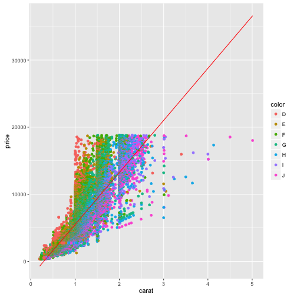

## Why this slides

Those slide are describing the assigment given during the Data Product courses. The goal of the project was to :
* Create a Shiny application and deploy it on Rstudio's servers
    + Write a shiny application with associated supporting documentation. The documentation should be thought of as whatever a user will need to get started using your application.
    + Deploy the application on Rstudio's shiny server
    + Share the application link by pasting it into the provided text box
    + Share your server.R and ui.R code on github

--- &twocol

## The diamonds shiny application

*** =left
The application is based on the diamonds data which is a default data available in R. It  contains the prices and other attributes of almost 54,000 diamonds. 

The application is showing the diamonds data a plot of the **Carat** as X Axis and **Price** as Y Axis reprenseted by the plot below.

It also calculate a linear regression of **Price ~ Carat** defined on the plot by the red line.

*** =right

--- .class #id 

## The Shiny application

The shiny application is composed by 3 pannels :
* The *Plot* panel is showing the a plot of the data as described in the previous slide. The widget on the left sidebar offer you the possibility to filter the data based on the color criteria and the carat ranges or to enable/disable the linear regression

* The *Data* panel is displaying the dataset you created on the previous pannel.

* The *Documentation* panel is giving a brief summary of the application.

--- .class #id 

## Conclusion

This conclude the presentation of the Data Product application if you have any remarks feel free to add them in the evaltion part.

